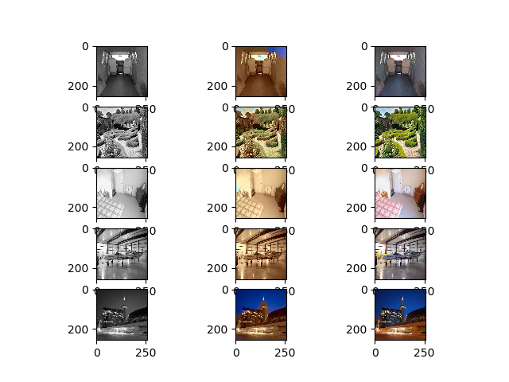
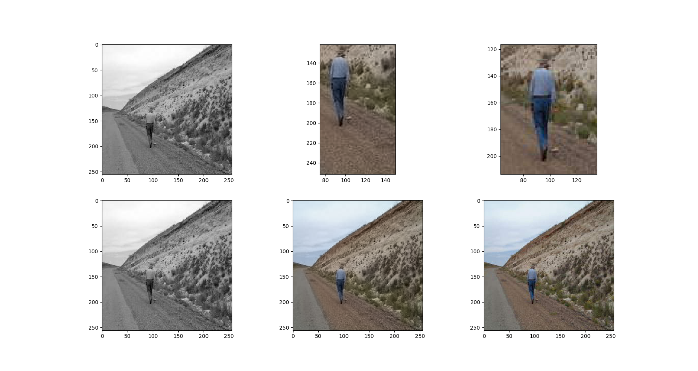

# corolization

AI agent to colorize b&amp;w images

## Motivations

Back when we were in high schools, there were a lot of shops where
you can hire someone to colour old photos of your childhood where cameras
had not been as good. And do you know that there is a [subreddit](https://www.facebook.com/shanghaiist/videos/567837453602857/) dedicated to
colorizing b&w photos. It would take an artist quite an amount of time ranging from
a few hours to a few days to colorize a b&w photo.

Imagine we have the power to instantaneously convert b&w into vigorously colorful
photos. We would be able to breathe life into hundreds of thousands of photos,
offering the viewers an more immersing experience looking at those photos from a
different era. An automated colorizer would be very useful for other purposes like
enhance/color-correct photos

We aim to produce an automated colorizer using deep learning computer vision
techniques to produce colorful images from b&w photos that is looks reasonably good
with the actual outside world as a benchmark

## The saga of Corolization

This is the story about how our colorizer has evolved over time

### The rudimentary generator

Our first attempt was to use a generator on the b&w image input and generate every
pixel of the output image. We tested the idea out using a simple neural network
with multiple fully-connected layers. After about 900 epochs of training, the net
seemed to have converged and produced this

 _Test case from CIFAR-10 dataset_

From the example above, we can see that the neural net has learnt a bit to immitate
the general shape of the object in the b&w image, however, the result generated is
far from what is considered "comprehensible" by human vision.

We realised that it is quite tedious to train a "from scratch" generator with the
b&w input to perform decently. It would be more reasonable to leverage on what we
already have as input (b&w image) and generate the color layers. We decided to try
this approach out

### The "too-generic" colorizer

We were looking for an inspiration when we stumbled on a
[blog post](http://tinyclouds.org/colorize/)
by [Ryan Dahl](https://github.com/ry). We try implementing his
proposed approach of a residual encoder backed with VGG-16.

As the name suggested, this architecture convolve the input through multiple layers
(that are drawn from VGG-16) and at the same time upscale the output to add back to
the previous output to be use for further upscaling. The final output (a pair of UV layers) will then be added back to Y-layer input. There is a huge drawback in
terms of resource for this model. It would take a few hours to cycle through one
epoch of [SUN dataset](https://groups.csail.mit.edu/vision/SUN/). Furthermore, the
improvement is rather slow and incremental, after a few epochs of the dataset, we
only achieved uniformly sepia-toned outputs. Even after more training epochs, we
only achieved rather saturated results, which is not close to what could be a good
guess of colors and would be too "ugly" for human cognition We decided that this
approach would be not robust enough and too slow for us to keep re-iterate over
the course of our limited timeframe for this project so we moved on to a new
approach.

### The colorful colorizer

After looking out for a few more inspiration, we settled on a [research idea](http://richzhang.github.io/colorization/) from
UC Berkerley [Rich Zhang](http://richzhang.github.io/).
The neural net architecture that was explored is rather simple and can be summed up
with this diagram below

This approach is rather simple: Taking in the L-layer (in a LAB color scheme) of an
image as input, convolute it through 8 convolutional blocks, then generate a
probability distribution of colors for each pixels (blue block) and finally output
the actual pair of AB-layers and upscale to full-size color layers.

This research approach is actually trying to tackle the problem of overly-saturated
coloring guess from precedent CNN attempts to colorize photos. Most of magic lies
inside the way the loss is formulated. Rather than outputting color values directly
like other approaches, all possible AB pairs of values are put into 313 different
"bins" (or can be preceived as categories) and converted back to actual color
values during prediction. Training labels are also soft-encoded using nearest
neighbors based on this color table belows.

We went ahead and implemented this neural net and achieved this decent result after
47 epochs.

-47epoch_vgood.png>)
 _From left to right (input, prediction, actual image)_

The result was not much better than the previously mentioned residual
encoder, however, it took a lot less time to train. Nevertheless, there is one
problem with this is that it always predict the general colors, which works well
for generic things like trees, sky but doesn't work as well for non-generic things
(which could be of any colors) by always predicting the "average" colors, making
the prediction look rather saturated

-47epoch_indoor.png>)
 _From left to right (input, prediction, actual image)_

As a result, we draw another technique from the paper called "class rebalancing",
which calculate weights for each color bins using the prior distribution of colors
of the whole dataset using this formula

 _q is the color bin, Z is the one-hot label at corresponding pixel_

The basic idea behind this formula is to rebalance the weightage of each color
during the training process by giving those that appear more often less weightage
and vice versa. We implemented this and trained the network through a few epochs

 _From left to right (input, prediction, actual image)_

Ignoring the fact that we only trained it for a few epochs (which explains why the
predictions are not very good), we can observe that the neural net now outputs more
"daring" guesses, making the predictions look more colorful and life-like.

At this moment, we also realised another problem with the current approach is that
the prediction is often overflow from one object to another. After a long process
of investigation by overfitting the neural net into one image and observing that
the predictions still overflow, we found out that the reason is because all
parameters were initialized from a uniform distribution (same starting point!) as
the default from PyTorch. We changed the initilization method into Xavier
intilization, which produced a very good distition between objects when overfitted.

 _From left to right (input, prediction, actual image)_

## Tuning the "hyper-paradio" (hyper-parameters)

We ultilized a specific technique of plotting traning loss for every batch with
different learning rates ([reference](https://towardsdatascience.com/estimating-optimal-learning-rate-for-a-deep-neural-network-ce32f2556ce0)).
We plotted multiple ranges of learning rates but from this best plot of learning
rates ranging from 0.1 to 10, we managed to find the optimal learning rate for our
approach to be about 0.5 and went ahead with it for training

## Further improvement

We have achieved a decent predictions with our current approach but we are aware
that there are still space for us to improve our model. One way of which we thought
is to use Generative Adversarial Networks (GAN). The "game" can be formulated such
that our current model will be the "forger", and there will be an extra model
acting as the "detector" trying to classifying the output from the "forger" apart
from the actual image. However, due to the time constraints of this project, we did
not have the chance to put this into practice.

## Technologies

* [PyTorch](http://pytorch.org/) (It's an awesome, python-first deep learning framework)
* [sk-learn](http://scikit-learn.org/) (Our casual friend)
* [sk-image](http://scikit-image.org/) (Python image magician)

## Team Members

* Vivek Kalyan
* Teo Si-yan
* Stanley Nguyen
* Jo Hsi Keong
* Tan Li Xuan

## Acknowledgement

_SUTD 50.035 Computer Vision Instructors and TAs:_

* Prof. Ngai-Man (Man) Cheung
* Prof. Gemma Roig
* Tuan Nguyen Anh Hoang
